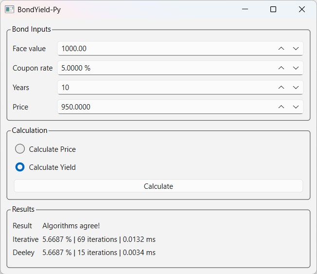

# BondYield-Py

Educational bond price and yield calculator with a C++ core, pybind11 bindings, and PySide6 GUI.



BondYield-Py is a desktop application for calculating fixed-rate bond prices and yields. The project combines a C++ bond math engine with a Python/PySide6 graphical user interface using pybind11 bindings.

The application demonstrates two different yield calculation techniques and highlights the trade-offs between simplicity, convergence speed, and supported input ranges.

## Features

* Bond price calculation
* Yield calculation using a stepwise search method
* Yield calculation using Deeley's method
* Calculation statistics including iteration count and execution time
* Input validation and error handling
* Automated pytest test suite
* C++ calculation engine exposed to Python through pybind11
* Cross-platform architecture using CMake and PySide6

## Architecture

```text
PySide6 GUI
     ↓
Python Package
     ↓
pybind11 Bindings
     ↓
C++ Bond Math Engine
```

The bond pricing and yield calculation algorithms are implemented in C++ while the user interface is implemented in Python using PySide6.

## Requirements

* Python 3.10 or later
* CMake 3.20 or later
* C++20 compatible compiler

Currently tested on:

* macOS (Apple Silicon)
* Windows 11
* Linux

## Installation

Installation builds the C++ extension module and installs all required Python dependencies automatically.

Clone the repository:

```bash
git clone git@github.com:gconde/BondYield-Py.git
cd BondYield-Py
```

### macOS / Linux

Create and activate a virtual environment:

```bash
python -m venv .venv
source .venv/bin/activate
```

Install the package:

```bash
pip install -e .
```

### Windows

Open:

```
x64 Native Tools Command Prompt for VS 2022
```

The x64 Native Tools prompt is important because the C++ extension must be built with a 64-bit compiler to match 64-bit Python.

Then run:

```cmd
python -m venv .venv
.venv\Scripts\activate
pip install -e .
```

## Running Tests

Install the development dependencies:

```bash
pip install -e ".[dev]"
```

Run the test suite:

```bash
pytest
```

## Running the Application

```bash
bond-yield
```

## Bond Model Assumptions

This demonstration application uses the following assumptions:

* Fixed-rate coupon bonds
* One coupon payment per period
* Integer periods to maturity
* Coupon rates expressed as decimal values (0.05 = 5%)
* Yield rates expressed as decimal values (0.05 = 5%)

The application is intended as an educational demonstration rather than a production fixed-income analytics library.

## Yield Calculation Methods

### Stepwise Search

The stepwise search method begins with an approximate yield estimate and iteratively adjusts the rate until the calculated bond price matches the target price within a specified tolerance.

Advantages:

* Simple implementation
* Supports a wider range of valid inputs

Disadvantages:

* May require many iterations to converge
* Slower than Deeley's method

If convergence is not achieved within the iteration limit, the method returns a yield value of `-1`.

### Deeley's Method

Deeley's method uses a more sophisticated iterative approach that generally converges much faster than the stepwise search method.

Advantages:

* Significantly fewer iterations
* Faster convergence for supported inputs

Disadvantages:

* Supports a narrower range of inputs in this demonstration

For unsupported inputs, the GUI reports that Deeley's method is unavailable while still allowing the stepwise search method to be used.

## Supported Deeley Input Range

The Deeley implementation has been tested for the following input ranges:

* Coupon rate ≥ 1%
* Periods to maturity ≥ 2
* Purchase price between 50% and 100% of face value

Inputs outside these ranges may still be processed successfully by the stepwise search method.

## Testing

The test suite includes:

* Bond pricing validation
* Yield repricing consistency tests
* Yield method comparison tests
* Invalid input validation tests
* Non-finite value (NaN and infinity) validation tests
* Edge case regression tests

## References

Chris Deeley, *Superseding Newton with a Superior Bond Yield Algorithm*

https://papers.ssrn.com/sol3/papers.cfm?abstract_id=1253166
